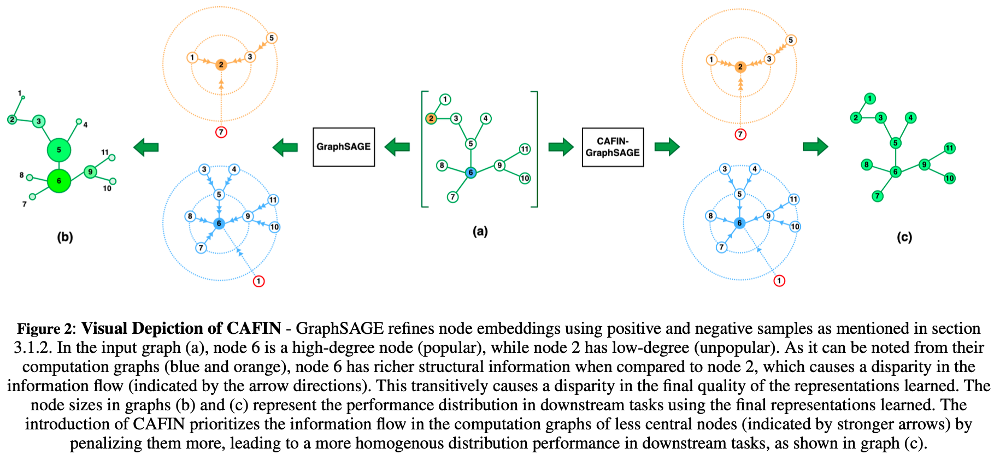

# CAFIN
CAFIN: Centrality Aware Fairness inducing IN-processing for Unsupervised Representation Learning on Graphs (Arvindh, Aakash, Amul, _et. al_, ECAI 2023): https://arxiv.org/abs/2304.04391



## Overview
The overall implementation is split task-wise,
- `src/nc/` contains Node Classification and `src/lp/` contains Link Prediction
- `approximate_distances.py`, `centrality_measures.py`, `dist.py` and `graph_division.py` contain the necessary preprocessing steps.
- `experiments.py` contains the modified loss functions of CAFIN (Exp 17), CAFIN-N (Exp 18) and CAFIN-P (Exp 19)
- `nc/imparity.py` contains the implementation of weighted imparity
- `utils.py` contains necessary supporting functions   
- `train.py` trains CAFIN-GraphSAGE
- `train_approx.py` uses approximate distances for training
- `lr.py` evaluates the generated embeddings
Overall pipeline can be run using `src/nc/run.sh` and `src/lp/run.sh` with appropriate variables set as required.

## Reference
If you use CAFIN in your research, please consider citing the following
```
@misc{
    arun2023cafin,
    title={CAFIN: Centrality Aware Fairness inducing IN-processing for Unsupervised Representation Learning on Graphs}, 
    author={Arvindh Arun and Aakash Aanegola and Amul Agrawal and Ramasuri Narayanam and Ponnurangam Kumaraguru},
    year={2023},
    eprint={2304.04391},
    archivePrefix={arXiv},
    primaryClass={cs.LG}
}
```